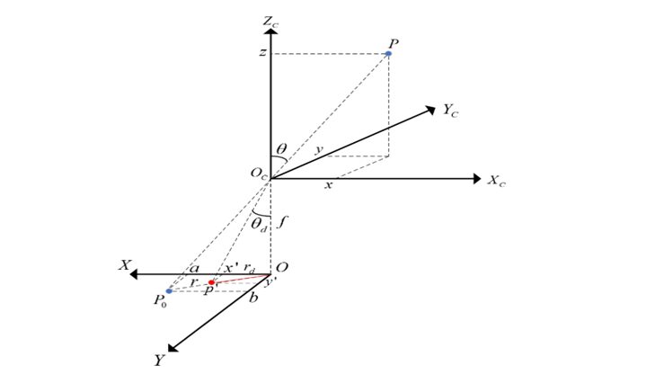

# 02 — Undistortion

Rectifies fisheye frames to a pinhole projection using the `K`, `D` from stage 01, so
that the rest of the pipeline can assume straight lines stay straight.

> **Provenance and verification.** No undistortion script was ever committed to the
> original team repository, although its outputs were. The algorithm here is the
> listing from the project report (`thesis/texfiles/implementation.tex`); the
> intrinsics are the ones from the team's working copy (`undistort.py`). Only the CLI,
> the batch loop and the docstrings are new.
>
> It is verified, not just transcribed: running it on a raw 4K frame reproduces the
> team's archived output (`LMS01-right-undistorted/frame_10.jpg`) with a **mean
> absolute difference of 1.00 / 255**, which is JPEG recompression noise. The
> `estimateNewCameraMatrixForUndistortRectify` path with `balance=0.0, fov_scale=0.8`
> is the one that matches; `--new-camera same-as-k` does not (mean |Δ| = 9.86).

## Run

```bash
python undistort_fisheye.py --calib ../01_calibration/calib.npz \
                            --images frames/ --out undistorted/ \
                            --balance 0.0 --fov-scale 0.8
```

**Input** — frames at any resolution *with the same aspect ratio* as the calibration
images, plus the `calib.npz` from stage 01. Without `--calib` the script falls back to
the intrinsics recorded in its own header:

```
DIM = (1920, 1080)
K   = [[591.0412707624,   0.0, 929.1522869318215],
       [  0.0, 594.439320988173, 535.87156962935 ],
       [  0.0,   0.0,             1.0            ]]
D   = [-0.005214816763725941, -0.030490227834563968,
        0.009805068492885203, -0.00013176708616799765]
```

**Output** — one rectified image per input. The archived run produced 40 frames at
3840×2160 from 4K video, and a separate 40-frame set at 1920×1080.

The raw 4K video frames are **circular fisheye** — the image circle does not fill the
sensor, so there is a black surround. Rectification maps that circle onto a pinhole
frame, which is why the output is both straighter and tighter than the input.



<sub>Figure 2.2 from the project report: how an incidence angle theta maps to image
radius under the fisheye model.</sub>

## How the resolution scaling works

This is the part that goes wrong most often. `K` is only valid at the resolution it was
estimated at (`DIM`, here 1920×1080). The video frames are 3840×2160. The script
rescales:

```python
scaled_K = K * dim1[0] / DIM[0]
scaled_K[2][2] = 1.0            # the homogeneous 1 must not be scaled
```

`D` is **not** scaled — the fisheye coefficients act on the normalised incidence angle
θ, which is resolution-independent. Only `K` carries pixel units.

`build_undistort_maps` raises on an aspect-ratio mismatch because the failure is
otherwise silent: the image comes out plausibly shaped but geometrically wrong.

## Key parameters

- **`balance`** (`0.0`) — trades field of view against valid pixels in
  `estimateNewCameraMatrixForUndistortRectify`. At `0.0` the output is cropped to the
  largest rectangle containing only valid pixels: no black wedges, narrowest field. At
  `1.0` the full field is kept and the corners are invalid. `0.0` was chosen because
  black border regions generate spurious SIFT keypoints along their edges, which then
  match across frames and survive the ratio test.
- **`fov_scale`** (`0.8`) — divides the new focal length, widening the field that fits
  in the output image. Below ~0.6 the periphery is stretched enough that SIFT's scale
  estimates degrade; above 1.0 the useful field shrinks for no gain.
- **`interpolation = INTER_LINEAR`**, `borderMode = BORDER_CONSTANT` — bilinear is
  adequate because the map is smooth; constant border makes invalid regions uniformly
  black rather than smearing edge pixels outward, which is what you want given the
  keypoint issue above.
- `initUndistortRectifyMap` is called with `CV_16SC2` — fixed-point maps, roughly 2×
  faster in `remap` than float maps, at sub-pixel accuracy that is irrelevant here.

## Failure modes

**Straight lines bend the wrong way after rectification.** Over-correction. Almost
always the `K` scaling: applying a 1080p `K` to a 4K frame halves the effective focal
length. Check `scaled_K[0][0]` against the input width — the ratio should match the
calibration's.

**Black wedges in the corners of the output.** `balance` is above 0. Expected at
`balance = 1.0`; if you see them at `0.0`, `D` is extrapolating outside the region the
calibration constrained, which points back at poor board coverage in stage 01.

**Output is uniformly black or garbage.** `dim2`/`dim3` left as `None` when the caller
expected them to default to the input size — `estimateNewCameraMatrixForUndistortRectify`
and `initUndistortRectifyMap` take different dimension arguments and passing `None` to
both does not mean the same thing.

**Slow on a long sequence.** `initUndistortRectifyMap` is the expensive call and depends
only on `K`, `D` and the resolution — `remap` itself is cheap. The report's listing
rebuilds the table per frame; this script builds it once and reuses it, rebuilding only
when the input resolution changes (which it logs).

## Downstream note

Rectifying to a pinhole model crops away the wide periphery that motivated the fisheye
lens. Stage 05 then rectifies **again** via COLMAP's `image_undistorter` before dense
stereo — a second resampling of already-resampled pixels. See the root README's
limitations.
