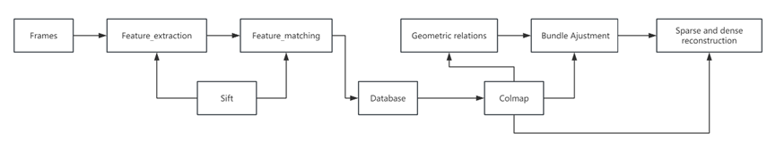

# Structure-from-Motion on Fisheye Video

A five-stage photogrammetry pipeline that turns handheld fisheye video into a sparse
and then dense 3D point cloud. Feature extraction, matching and geometric verification
are done in OpenCV and written into a COLMAP-format SQLite database; incremental
registration, triangulation and bundle adjustment run through `pycolmap`; dense stereo
runs through the COLMAP CUDA binary.

Originally a five-person MSc team project at the Chair of Multimedia Communications and
Signal Processing (LMS), FAU Erlangen-Nürnberg, Oct 2024 – Feb 2025. This repository is
a cleaned-up version: the raw recordings and intermediate archives have been removed
from history, the stage directories renamed to reflect what they do, and the
undocumented parts written up. See [Provenance](#provenance) for what changed.

**Input:** MP4 video from a fisheye camera (3840×2160), plus ~30 stills of a 10×8
chessboard shot with the same lens at 1920×1080.
**Output:** `points3D.bin` (sparse) and `fused.ply` (dense), plus a COLMAP database
holding keypoints, descriptors and geometrically verified two-view matches.



<sub>Diagram from the project report source. To be replaced by `docs/sfm_pipeline.svg`
once available; the label reads "Bundle Ajustment" in the original.</sub>

---

## Pipeline

| Stage | Directory | Does | Produces |
|---|---|---|---|
| 1 | [`01_calibration/`](01_calibration/) | Fisheye intrinsics from chessboard corners (`cv2.fisheye.calibrate`) | `K`, `D`, RMS reprojection error |
| 2 | [`02_undistortion/`](02_undistortion/) | Rectify every frame with `K`,`D` scaled to video resolution | Undistorted 4K frames |
| 3 | [`03_feature_matching/`](03_feature_matching/) | Standalone two-frame SIFT + FLANN + F-RANSAC experiment | Side-by-side match visualisations |
| 4 | [`04_geometry_estimation/`](04_geometry_estimation/) | Epipolar geometry — no standalone script, see the README for where it actually lives | — |
| 5 | [`05_reconstruction/`](05_reconstruction/) | Exhaustive matching into a COLMAP DB, incremental SfM + BA, dense stereo | `points3D.bin`, `fused.ply` |

Stages 1–3 are standalone experiments run once to fix parameters. Stage 5 is the
pipeline that actually produced the results; it re-does feature extraction and matching
internally rather than consuming the output of stage 3.

---

## Running it

Dense reconstruction shells out to the COLMAP 3.11.0 CUDA binary; everything else is
Python 3.9. See [`docs/setup_windows.md`](docs/setup_windows.md) for the original
Anaconda instructions.

```bash
pip install -r requirements.txt
```

Each stage runs on its own:

```bash
python tools/extract_frames.py --video path/to/clip.mp4 --out frames/ --interval 10
python 01_calibration/calibrate_fisheye.py --images images_calibration/ --out calib.npz
python 02_undistortion/undistort_fisheye.py --calib calib.npz --images frames/ --out undistorted/
python 03_feature_matching/match_shi_sift.py --img1 undistorted/frame_95.jpg --img2 undistorted/frame_96.jpg
python 05_reconstruction/sfm_pipeline.py --workspace 05_reconstruction/workspace --colmap /path/to/colmap.exe
```

Stage 5 expects images in `<workspace>/images/` and writes `database.db`,
`sfm/0/points3D.bin` and `sfm/dense/fused.ply` beside them.

---

## Method choices

**Fisheye model instead of the pinhole + radial model.** The lens covers a wide enough
field of view that `cv2.calibrateCamera`'s polynomial radial model does not fit the
periphery. `cv2.fisheye` implements the Kannala–Brandt equidistant model
(θ_d = θ(1 + k₁θ² + k₂θ⁴ + k₃θ⁶ + k₄θ⁸)), which is the right family for this lens. The
cost is a separate `D` with four coefficients and a separate undistortion call chain
that most SfM tooling does not accept directly — which is exactly where stage 5 breaks
down (see [Known limitations](#known-limitations)).

**Undistort before matching, rather than matching on raw fisheye frames.** The raw 4K
frames are circular fisheye — the image circle does not fill the sensor. SIFT's
descriptor assumes a locally affine neighbourhood. Under strong radial distortion the
same physical patch is sheared differently depending on where it lands in the frame, so
descriptors of corresponding points diverge toward the image border. Rectifying first
removes that dependence. Note this is a well-known argument, not something measured in
this repo — no raw-vs-undistorted matching benchmark was run here, and the "45% more
correct correspondences" figure in the project report is not reproducible from any code
in this repository.

**SIFT rather than ORB.** The frames are 4K stills sampled every 10th frame from
handheld video, matched exhaustively offline. There is no real-time budget, so ORB's
main advantage — binary descriptors, orders of magnitude faster — buys nothing, while
its weaker scale handling and lower descriptor distinctiveness cost inlier ratio on
repetitive indoor structure (tiled floors, parking-deck pillars). SIFT is also what
COLMAP itself uses, so descriptors written into the database are the same kind the
downstream mapper expects. No ORB baseline was actually run for comparison.

**Fundamental matrix rather than essential matrix for verification.** At the point
where pairs are verified, the intrinsics being written into the database are a
placeholder (see limitations), so `E` cannot be recovered reliably from `F` by
`E = KᵀFK`. `cv2.findFundamentalMat` needs no calibration and its 7-point/8-point
RANSAC is enough to reject gross mismatches. The two-view geometry rows are written
with `config = 2` ("F verified, E/H not computed"), and `E`/`H`/`qvec`/`tvec` are
identity/zero placeholders — pycolmap re-estimates relative pose itself during
initialisation, so it does not read those columns.

**Ratio test before RANSAC, not instead of it.** The two filters reject different
failure modes. Lowe's ratio test rejects matches that are locally ambiguous — the
nearest and second-nearest descriptors are similar, so the correspondence is
individually untrustworthy. RANSAC rejects matches that are individually confident but
globally inconsistent with a single epipolar geometry, which is what repeated structure
produces. Running only the ratio test leaves a coherent set of wrong matches on
repeating façades; running only RANSAC leaves it drowning in noise and needing far more
iterations to find the consensus set.

---

## Parameters that matter

| Parameter | Where | Value | Effect |
|---|---|---|---|
| `CHECKERBOARD` | stage 1 | `(9, 7)` | Inner corner count, not square count. Wrong value → `findChessboardCorners` returns False on every image |
| `subpix` window | stage 1 | `13×13` | Corner refinement search radius. Too large on a fisheye frame pulls in curved neighbouring edges; too small loses sub-pixel accuracy |
| `CALIB_CHECK_COND` | stage 1 | **disabled** | Aborts when a view is ill-conditioned. Not an oversight: with it enabled, the calibration set behind every published result here is rejected outright. Exposed as `--check-cond` |
| `balance` | stage 2 | `0.0` | 0 crops to the largest all-valid rectangle (no black corners, narrowest FOV); 1 keeps the full FOV with invalid borders |
| `fov_scale` | stage 2 | `0.8` | Shrinks the output focal length, widening the visible field at the cost of resolution per pixel |
| `ratio_test` | stage 5 | `0.6` | Lowe's ratio. Lower = fewer, cleaner matches. Tightening from 0.55 → 0.6 was the one parameter changed between pipeline iterations |
| `ransac_thresh` | stage 5 | `2.0` px | Max Sampson distance to the epipolar line for an inlier. Stage 3's standalone script uses 5.0 px — the looser value passes more matches but admits geometrically sloppy ones |
| `min_inliers` | stage 5 | `5` | Minimum verified matches to keep a pair. This is very low; the shipped database contains pairs with only 7 inliers, which contribute almost nothing but cost mapper time |
| `nfeatures` | stage 5 | `8192` | An upper bound, not a target. The shipped database averages 1527 keypoints per image (min 510, max 2491) — the cap is never the binding constraint |

---

## Results actually in this repository

From `05_reconstruction/workspace/database.db`, produced from 48 frames
(`frame_52.jpg` … `frame_99.jpg`) of an indoor sequence at 3840×2160:

- **48** images, one shared camera
- **1527** keypoints per image on average (range 510–2491)
- **1003** geometrically verified pairs out of 1128 exhaustive pairs (88.9%)
- **67.3** inliers per verified pair on average (range 7–437)

Calibration:

- The published `K`/`D` come from a fit with an **RMS reprojection error of 204.5 px**.
  A healthy chessboard calibration lands near 1 px. Two of the source views are jointly
  degenerate; `CALIB_CHECK_COND` rejects the set outright, and dropping either one
  yields intrinsics differing by a factor of 25 (fx 772 vs 191). Details and the
  reproduction in [`01_calibration/README.md`](01_calibration/README.md).
- `K = [[591.041, 0, 929.152], [0, 594.439, 535.872], [0, 0, 1]]` at 1920×1080
- `D = [-0.0052148, -0.0304902, 0.0098051, -0.00013177]`
- The chessboard stills committed here are *not* that source set: they detect 11 of 29
  corners rather than 20 of 28, and calibrate to a different and much better-conditioned
  solution (RMS 1.74 px, fx ≈ 604).

The sparse and dense point clouds themselves are not committed — only the database that
seeds them. Reported dense reconstruction time was 2–3 h on a current GPU and roughly
17 h on an older one, for the same 48-image input.

---

## Failure modes seen, and how they were tracked down

**`findChessboardCorners` silently fails on a third of the calibration set.**
The rejected images are not obviously bad to the eye. On a fisheye lens the board bows
enough near the frame border that the detector's quad-linking step cannot chain the
rows, and it returns `False` with no diagnostic. The tell is only the final count, which
the script now prints together with the rejected filenames. The source set loses 8 of 28;
the stills committed here lose 18 of 29. The flags
`CALIB_CB_ADAPTIVE_THRESH | CALIB_CB_NORMALIZE_IMAGE` recover the ones lost to uneven
illumination, but not the geometric failures. Shooting more views than needed and
keeping the board away from the extreme periphery is what actually helps.

**Calibration aborts on `fabs(norm_u1) > 0`.** An OpenCV assertion deep in
`InitExtrinsics`, naming neither the view nor the cause. `--check-cond` upgrades it to
`Ill-conditioned matrix`, still unnamed; a leave-one-out sweep finds the culprits. On
this dataset two views are jointly degenerate and dropping either lets it converge — to
intrinsics that differ from each other by a factor of 25, which is the real lesson.

**Calibration converges but the undistorted image is warped wrong.** This shows up as
straight lines bending the *other* way after rectification. It comes from `K` being
estimated at one resolution and applied at another. The chessboard stills are
1920×1080; the video frames are 3840×2160. Stage 2 handles this by scaling
`K` by `dim1[0] / DIM[0]` and resetting `K[2][2] = 1.0`. Skipping that scale halves the
effective focal length and over-corrects. The assertion on aspect ratio in
`undistort_fisheye.py` exists because the failure is otherwise silent.

**Descriptor blob size mismatch when reading back from the database.** COLMAP stores
descriptors as raw uint8 blobs with no per-row length. Stage 5 re-derives the row count
as `len(blob) // 128` and skips the image if it is not divisible — that check exists
because a partially written blob otherwise surfaces much later as a reshape error deep
inside the matching loop, pointing at the wrong image.

**Pairs pass verification with almost no inliers.** With `min_inliers = 5`, pairs whose
frames barely overlap still get written. They do not break the mapper — it filters them
during registration — but they inflate the pair count and matching time. The signal is
the printed per-pair inlier count: a healthy adjacent-frame pair here runs in the
hundreds, so anything in single digits is two frames that happen to share a repeated
texture.

---

## Known limitations

**The calibrated intrinsics never reach the reconstruction.** This is the largest gap.
Stage 5 registers a hardcoded placeholder camera — `SIMPLE_RADIAL`, 3840×2160,
f = 1500, principal point at the exact image centre, `prior_focal_length = True` — and
the shipped database confirms those are the values that were used. The calibrated
fisheye focal scaled to 4K would be ≈1182 px, and the calibrated principal point is not
at the centre. Because stage 2 has already rectified the frames, a pinhole model is the
right *family* at that point, but the specific numbers are a guess that COLMAP then
self-calibrates away from. Feeding the scaled calibration in as a prior is the obvious
next step and was not done.

**Stage 02's script is a reconstruction, not the original.** No undistortion script was
ever committed by the team. The one here is the algorithm from the report's LaTeX source
with the intrinsics from the team's working copy, wrapped in a CLI. It is verified
rather than assumed: on a raw 4K frame it reproduces the team's archived rectified
output to a mean absolute difference of 1.00 / 255, i.e. JPEG noise.

**The calibration behind the published results did not converge.** RMS 204.5 px on an
ill-conditioned view set. It happens to rectify the footage correctly — verified — but
it is not trustworthy enough to use as a prior, and the reconstruction quietly works
around it by registering a placeholder camera instead. Redoing the capture with better
board coverage is the fix, and was not done.

**Matching is exhaustive and O(n²).** 48 frames is 1128 pairs. This is fine at this
scale and will not survive a few hundred frames. Sequential or vocabulary-tree matching
is the standard answer and is not implemented here.

**The descriptor round-trip is lossy.** Descriptors are L2-normalised, scaled by 512,
clipped to 255 and stored as uint8, then decoded by dividing by 512. Any component
above roughly 0.498·‖d‖ is clipped flat. COLMAP's own convention stores SIFT
descriptors without this normalisation, so the values in the database are not directly
comparable to COLMAP-extracted ones.

**No quantitative accuracy evaluation.** There is no ground-truth model in this
repository and no code that compares a reconstruction against one. The metric figures
quoted in the individual project report (3.2 mm mean deviation from a laser scan, 2.5 mm
positional / 0.4° angular pose error) cannot be reproduced from anything here and are
not repeated as results above.

**Fisheye-native reconstruction was never attempted.** The pipeline rectifies to a
pinhole model and reconstructs from that, which discards the periphery that motivated
using a fisheye lens in the first place. Reconstructing directly on the sphere, or with
COLMAP's own fisheye camera models, would avoid the crop.

---

## What I Built

This is the cleanup and documentation pass on a five-person team project; the list below
is limited to work that can be pointed at in this repository. Authorship of the original
pipeline code is spread across the team and is not claimed here.

- Refactored the two-frame matching experiment into
  [`03_feature_matching/match_shi_sift.py`](03_feature_matching/match_shi_sift.py):
  split a single top-to-bottom script into five functions, added an argparse CLI
  covering every tuning knob, added explicit failures for empty corner sets and for
  fewer than 8 matches (`findFundamentalMat`'s minimum), removed the blocking
  `imshow`/`waitKey` so it runs headless, and dropped an unused histogram-equalisation
  path that had no effect on the result.
- Reconstructed the missing undistortion stage as
  [`02_undistortion/undistort_fisheye.py`](02_undistortion/undistort_fisheye.py) from
  the report's LaTeX listing and the intrinsics in the team's working copy, and
  verified it against the archived output: mean absolute difference 1.00 / 255 on a raw
  4K frame. Hoisted the remap-table construction out of the per-frame loop and made it
  rebuild only on a resolution change.
- Recovered the calibration record and reproduced it, which showed the published
  intrinsics come from a fit that terminated rather than converged: the value archived
  as `res` is the RMS reprojection error in pixels (204.5, against ~1 px for a healthy
  chessboard calibration), two of the source views are jointly degenerate, and dropping
  one or the other yields intrinsics differing by a factor of 25. That also explains why
  `CALIB_CHECK_COND` had to be disabled. Written up with the reproduction in
  [`01_calibration/README.md`](01_calibration/README.md).
- Gave every stage a uniform argparse CLI so it runs standalone, replacing paths
  hardcoded to one developer's machine; `sfm_pipeline.py` now resolves COLMAP from
  `--colmap`, `$COLMAP_EXE` or `PATH`, and can run headless.
- Fixed the stray quote that made `sfm_pipeline.py` unparseable, a float passed to an
  integer format spec in the snapshot path, and a truncation that fed RANSAC an
  arbitrary 250-match subset in keypoint order instead of every candidate that passed
  the ratio test — on the archived frame pair that takes RANSAC's input from 250 to 559,
  of which 350 are inliers.
- Turned `cv2.fisheye.calibrate`'s bare `fabs(norm_u1) > 0` assertion into a message
  that names the diagnosis procedure, and added `--exclude` to act on it.
- Audited the pipeline against its archived outputs and documented every defect in
  [`docs/known_bugs.md`](docs/known_bugs.md), separating the ones safe to fix from the
  ones that would change the results — among the latter, that the calibrated intrinsics
  never reach the reconstruction, established by reading the camera table out of the
  shipped `database.db`.


---

## Repository layout

```
01_calibration/          Fisheye intrinsics from chessboard corners
02_undistortion/         Rectification of video frames using K, D
03_feature_matching/     Standalone Shi-Tomasi + SIFT + F-RANSAC experiment
04_geometry_estimation/  Documentation only — see its README
05_reconstruction/       COLMAP-database SfM: matching, incremental mapping, BA, dense
  third_party/           database.py, read_write_model.py — upstream COLMAP, BSD
tools/                   Frame extraction from video, point cloud viewer
docs/                    Reports, setup notes, pipeline diagram, bug list
```

## Provenance

The stage directories were originally named after project phases
(`Phase_2: Calibration`, `Phase_3: Undistortion`, `Phase_4: Apply_SIFT`,
`Phase_6: Estimate`), which did not describe their contents and skipped a number. The
history explains the gap: phase 1 was a literature review with no code, the SIFT
directory was renamed from `Phase_3` to `Phase_4` partway through, `Phase_4:
development of SFM` was created empty and deleted, `phase_5: development of SFM` was
renamed to `final/` and holds the actual pipeline, and `Phase_6: Estimate` was created
but never populated. Directories are now numbered by pipeline position, not by phase.

Raw video (6.5 GB), intermediate image archives and slide decks have been removed from
git history — they exceeded GitHub's per-file limit and made the repository
unclonable. [`docs/data.md`](docs/data.md) records what they were and how to regenerate
the derived data.

`05_reconstruction/third_party/database.py` and `read_write_model.py` are unmodified
upstream COLMAP scripts (BSD-3-Clause, ETH Zürich / UNC Chapel Hill) and carry their
original headers.

## References

Kannala & Brandt, *A generic camera model and calibration method for conventional,
wide-angle and fish-eye lenses*, TPAMI 2006 — the fisheye model behind `cv2.fisheye`.
Zhang, *A flexible new technique for camera calibration*, TPAMI 2000 — the chessboard
calibration procedure. Schönberger & Frahm, *Structure-from-Motion Revisited*, CVPR
2016 — COLMAP's incremental mapper. Full list in
[`docs/references.md`](docs/references.md).
